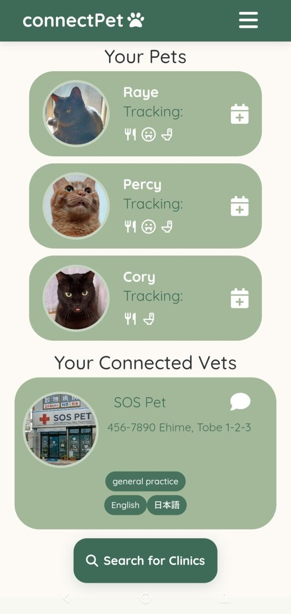
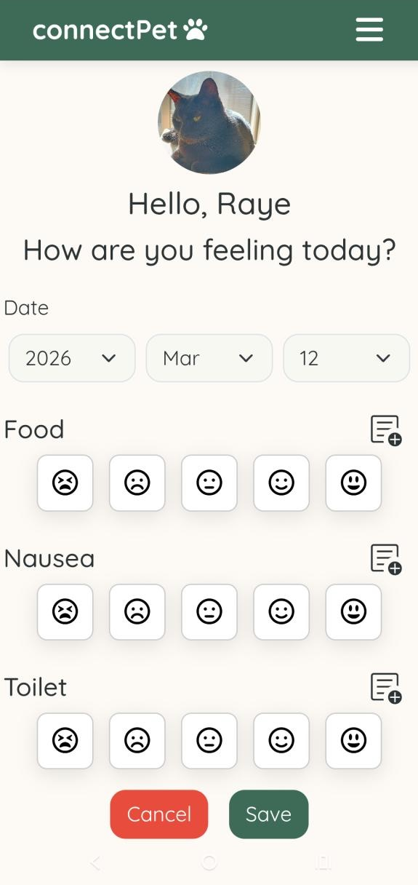
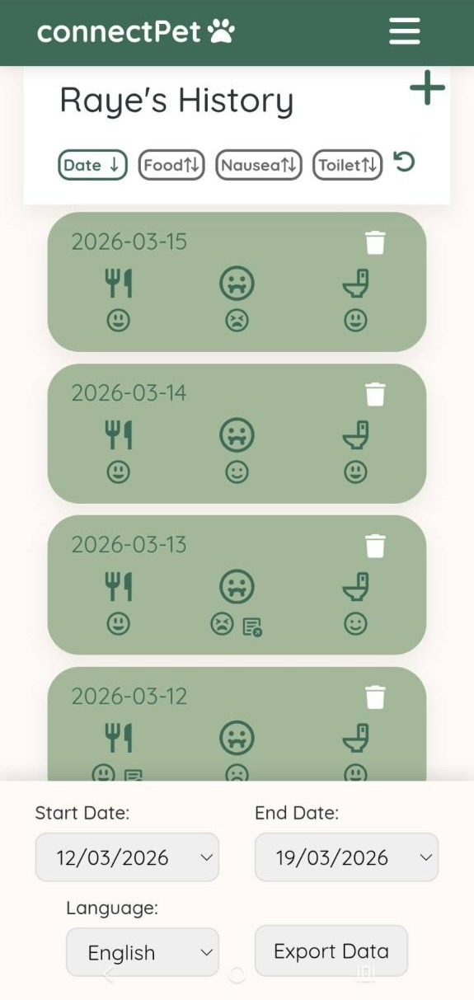

# 🐈‍⬛ connectPet

connectPet is a Ruby on Rails application that facilitates connections between pet owners and veterinarians. The app allows users to track pet health data, connect with veterinarians, and generate AI-powered insights with multilingual support.

**<a href="https://www.connectpet.online/" target="_blank">View Live App</a>**

**<a href="https://youtu.be/-bB-0kQLatw?t=493" target="_blank">Watch Presentation</a>** — Le Wagon Tokyo Demo Day at Google for Startups Campus, March 13, 2026

**Note:** This application is designed with a **mobile-first approach**. Desktop layout optimization is in progress.

---

## Screenshots

<div style="display: flex; gap: 20px; justify-content: center; flex-wrap: wrap;">
  
  
  
</div>

---

## Features

- **User Authentication** — Secure registration and login with Devise
- **Pet Health Tracking** — Monitor and log pet health data over time
- **Veterinarian Connections** — Find and connect with veterinary professionals
- **AI-Powered Insights** — Generate intelligent health recommendations with multilingual support
- **Profile Management** — Manage user and pet profiles in real-time
- **Image Storage** — Upload and manage images seamlessly via Cloudinary
- **Role-Based Access** — Fine-grained authorization with Pundit
- **PDF Reports** — Generate downloadable pet health records with Wicked PDF
- **High Performance** — Redis caching for optimal application speed

## Technology Stack

| Component | Technology |
|-----------|-----------|
| **Language** | Ruby 3.3.5 |
| **Framework** | Rails 7.1.6 |
| **Database** | PostgreSQL |
| **Frontend** | Bootstrap 5, Stimulus JS |
| **Authentication** | Devise |
| **Image Storage** | Cloudinary |
| **Authorization** | Pundit |
| **PDF Generation** | Wicked PDF |
| **Caching** | Redis |
| **Deployment** | Heroku |

## Team Members

- [Katie Wood](https://www.linkedin.com/in/katie-wood6319/)
- [Renato Shimabukuro](https://www.linkedin.com/in/renato-shimabukuro-6b74a8112/)
- [James Newsom](https://www.linkedin.com/in/james-newsom-a11351351/)
- [Troy Zangara](https://www.linkedin.com/in/troyzangara/)
- [Damien Joubert](https://www.linkedin.com/in/damienus-joubert/)
- [Chantal Gervais](https://www.linkedin.com/in/chantal-gervais-143041160/)

## Contributing

Contributions are welcome! Please follow these steps:

1. Open an issue to discuss your proposed changes
2. Create a feature branch (`git checkout -b feature/amazing-feature`)
3. Commit your changes (`git commit -m 'Add amazing feature'`)
4. Push to the branch (`git push origin feature/amazing-feature`)
5. Open a Pull Request

## Getting Started

### Prerequisites

- Ruby 3.3.5
- Rails 7.1.6
- PostgreSQL
- Bundler

### Installation

1. **Clone the repository**
   ```bash
   git clone <repository-url>
   cd connectPet
   ```

2. **Install dependencies**
   ```bash
   bundle install
   ```

3. **Configure the application**

   Create `.env` file with your Cloudinary credentials:
   ```bash
   touch .env
   ```
   Add to `.env`:
   ```
   CLOUDINARY_URL=your_cloudinary_url_key
   ```

   ⚠️ **Important:** Make sure `.env` is in your `.gitignore` to avoid committing sensitive credentials.

   Set up the database:
   ```bash
   rails db:create
   rails db:migrate
   rails db:seed
   ```

4. **Start the server**
   ```bash
   rails s
   ```

Visit `http://localhost:3000` in your browser.

## License

This project is licensed under the MIT License. See the [LICENSE](LICENSE) file for details. Feel free to use, modify, and learn from the codebase.
